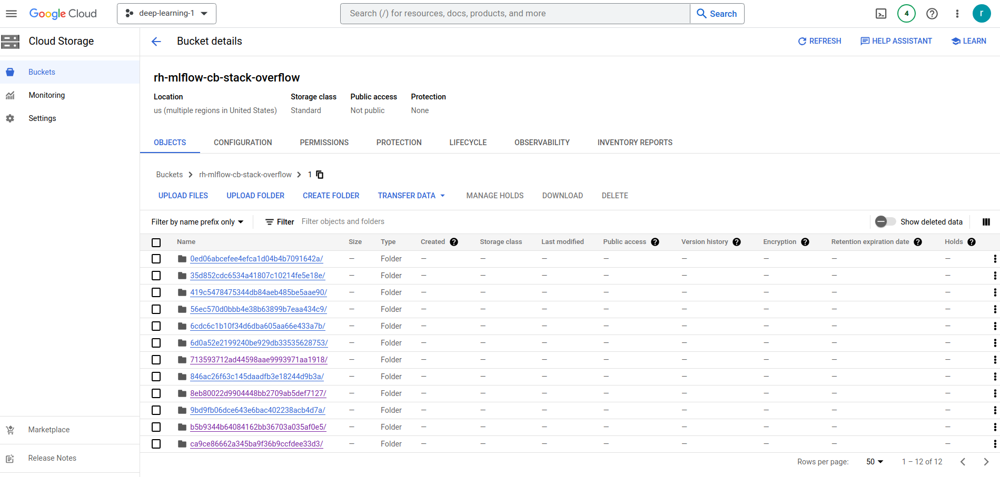

# Compensation prediction - Stack Overflow 2023 salary survey

This project is to predict the compensation of software developers based on their Stack Overflow survey responses.

In the context of the software development landscape, the intricacies underlying compensation determinants have gained paramount importance. The "Compensation Prediction - Stack Overflow 2023 Salary Survey" initiative endeavors to devise a predictive model that harnesses the power of machine learning to accurately anticipate the compensation of software developers. This model is constructed based on a comprehensive analysis of survey responses obtained from Stack Overflow - a question-and-answer website for programmers.

The primary objective of this undertaking is to unravel the factors driving the diverse salary structures prevalent among software developers. This project employs the Stack Overflow survey dataset, curated during the May 2023 survey phase. By harnessing this expansive dataset, which is publicly accessible, the project aims to decipher the nuanced interplay of variables that impact compensation dynamics across various developer categories.

Beyond its core compensation prediction focus, this initiative assumes an additional dimension by serving as an instructional blueprint for **Machine Learning Operations (MLOps)** practices. Through each phase of the project lifecycle, it strategically highlights the application of advanced MLOps techniques, emphasizing the significance of methodological rigor and comprehensive proficiency. By exemplifying these practices in a real-world context, the project underscores the holistic skill set required for seamless orchestration of machine learning endeavors.

- **Machine learning (ML) Model**:
    - Machine learning algorithm used: **CatBoostRegressor**
    - Evaluation method: **Root mean squared error (RMSE)**
    - Brief explanation of the obtained ML model:  SHapley Additive exPlanations (**SHAP**)
- **MLOps framework**: [MLOps maturity model](https://learn.microsoft.com/en-us/azure/architecture/example-scenario/mlops/mlops-maturity-model)


## Dataset

Central to the "Compensation Prediction - Stack Overflow 2023 Salary Survey" project is the Stack Overflow 2023 salary survey dataset. This meticulously curated dataset, openly accessible to the public, forms the bedrock of the project's empirical foundation. It enables comprehensive exploration and analysis, facilitating the extraction of valuable insights into the realm of software developers' compensation trends.

dataset: [Stack Overflow 2023 salary survey](https://cdn.stackoverflow.co/files/jo7n4k8s/production/49915bfd46d0902c3564fd9a06b509d08a20488c.zip/stack-overflow-developer-survey-2023.zip)

- Filename: `stack-overflow-developer-survey-2023.zip`


## ML model: CatBoostRegressor

CatBoost Regressor is a machine learning algorithm that is specifically designed for regression tasks. It is a gradient boosting framework from Yandex that offers high performance and is particularly well-suited for handling categorical features in the dataset. CatBoost stands for "Categorical Boosting," highlighting its ability to handle categorical variables effectively.

CatBoost Regressor was chosen due to below features that match with our problem at hand:

- Handling Categorical Features: Directly handles categorical features without the need for extensive preprocessing such as one-hot encoding. "ordered boosting" technique to naturally incorporate categorical variables into the boosting process.

- Built-in Feature Importance: Built-in feature importance calculations determining which features contribute most to the predictions.

- Optimized GPU Support: Optimized to leverage the computational power of GPUs, which significantly speeds up the training process, especially for large datasets.

- Handling Missing Values: Handles missing values in the dataset during training without requiring imputation beforehand.

- Automatic Hyperparameter Tuning: Includes automatic hyperparameter tuning capabilities, which helps to find the optimal settings for the problem without extensive manual experimentation.

- Robust to Overfitting: Includes regularization techniques that make it more robust to overfitting compared to other boosting algorithms.


## MLOps

MLOps brings DevOps principles to machine learning. It is a set of best practices to put ML models into production and automate the life-cycle. The extent to which MLOps is implemented into a team or organization could be expressed as maturity as explained in [MLOps maturity model](https://learn.microsoft.com/en-us/azure/architecture/example-scenario/mlops/mlops-maturity-model).

MLOps helps in:

- Tracking model iterations and reproduce results reliably,
- Monitoring model performance and deliver domain-specific metrics for ML
- Delivering models safely and automatically into production.

A high maturity level is not always needed because it comes with additional costs. The trade-off between automated model maintenance and the required effort to set up the automation should be onsidered. An ideal maturity level could be picked based on the use case / SLAs and the number of models deployed.

**Our goal with this project is to start utilizing MLOps and increase MLOps maturiy level over time with number of iterations of the project.** In the initial stages of the project, we will focus on an intricate balance of keeping costs down to minimum (e.g. cloud services costs) and deploy MLOps practices in a hybrid manner -  more locally.

## MLOps Tools used

1. Experiment tracking and model registry: **MLFlow**
2. Workflow orchestration: **Prefect**
3. Model deployment: **Docker container**
4. Model monitoring: **Evidently** and **Grafana**
5. Model versioning: **Git/Github**

Note: This project was entirely developed in cloud using:
1. Google Cloud Platform (GCP): VM instance running Ubuntu mimicking local system
    - Distributor ID:	Ubuntu
    - Description: Ubuntu 22.04.2 LTS
    - Release: 22.04
    - Codename: jammy

2. Google Cloud Storage (GCS): for storing MLFlow model artifacts


## How to run this project?

### Prerequisites

- Dataset downloaded
- `anaconda` or `miniconda` with `conda` package manager
- `pipenv`, `docker` and `docker-compose`
- Access to gcs bucket on Google Cloud Platform (Free trial account is sufficient)

### Steps

#### A) Setup local environment

1. Create a new conda environment and activate
```
conda create -n stack-overflow python=3.11
conda activate stack-overflow
```
Note: In all subsequent steps below, while using multiple terminals/tabs, always ensure that you are in the `stack-overflow` conda environment.

2. Clone the repo
```
git clone https://github.com/ranga4all1/stack-overflow-2023.git
```
3. Install dependencies
```
cd stack-overflow-2023-ds
pip install -r requirements.txt
```

#### B) Data

1. Download data (This step is NOT needed if you cloned entire repo)
```
cd data/raw
wget https://cdn.stackoverflow.co/files/jo7n4k8s/production/49915bfd46d0902c3564fd9a06b509d08a20488c.zip/stack-overflow-developer-survey-2023.zip
```

#### C) Model traing

#### Train model alongwith tracking via mlflow and save model artifacts to gcs bucket

1. Create GCS bucket for mlflow files storage

   e. g. name: `rh-mlflow-cb-stack-overflow`

   Note: Make sure to update commands in below steps to use your bucketname.

    

2. Start the mlflow tracking server from local terminal and keep it running
```
mlflow server --backend-store-uri=sqlite:///mlflow.db --default-artifact-root=gs://rh-mlflow-cb-stack-overflow
```
3. From another terminal tab, Check access to CGS from mlflow server - follow prompts and complete auth process
```
gcloud auth application-default login
```
4. Train model using below scripts
```
python experiment-tracking/preprocess_data.py --raw_data_path data/raw --dest_path data/processed

python experiment-tracking/train.py

python experiment-tracking/register_best_model.py --top_n 5
```

5. Verify in MLFlow server at http://127.0.0.1:5000 :
    1. Parameters logged
    2. Model artifacts pointing to GCS bucket
    3. Model is registered

    
    
    


5. Check GCS bucket for model artifacts

    


#### D) Orchestration

1. Start prefect server in another terminal tab and keep it running
```
prefect server start
```

Default prefect server settings should be enough for this project. In case of any issues, run below script from another terminal tab.
```
prefect profile ls
prefect profile use default
prefect config set PREFECT_API_URL=http://127.0.0.1:4200/api
```

2. Access PREFECT server at http://127.0.0.1:4200 and create pool:

    name: catboost-pool

    Infrastructure Type: local subprocess

    

3. Run below script to start prefect project
```
cd orchestration
prefect project init
(Note: select option local)
cd ..
```
Following files will be created
```
.prefectignore
prefect.yaml
.prefect/
```

4. in another terminal tab, run below script. Answer 'n' for all prompts.
```
prefect deploy orchestration/orchestrate.py:main_flow -n stackoverflow1 -p catboost-pool
```

5. To execute flow runs from this deployment, start a worker in a separate terminal that pulls work from the
'catboost-pool' work pool:
```
prefect worker start --pool 'catboost-pool'
```

6. To schedule a run for this deployment, use the following command:
```
prefect deployment run 'main-flow/stackoverflow1'
```
7. Access PREFECT server at http://127.0.0.1:4200 and check deployment run status

    Note: Alternatively if your deployment is not running, find Deployments/stackoverflow1 and click Run-> Quick run

    

8. Check GCS bucket and MLFLOW server for model artifacts again. Note down below parameters for flow 'train-best-model'.

- run_id
- logged_model path

You will need to use those parameters in next steps. Update scripts with your parameters whereever needed.


#### D) Batch Deployment

I) Test batch scoring job from terminal tab using
`python deployment/batch/score.py stack-overflow 2023 <run_id>`
```
python deployment/batch/score.py stack-overflow 2023 8ac5e4553c464697a9d70d833458e3d2
```

II) Schedule batch scoring job with Prefect in separate pipenv virtual env
1. Create environment
```
cd deployment/batch

pipenv --python=3.11
pipenv install prefect==2.11.0 mlflow==2.5.0 catboost==1.2 pandas pyarrow gcsfs google-cloud-storage
```
2. Stop existing prefect servers. Start prefect server inside pipenv virtual env
```
pipenv shell
prefect server start
```
3. From another terminal test score.py
```
cd deployment/batch

pipenv shell
python score.py stack-overflow 2023 8ac5e4553c464697a9d70d833458e3d2
```

III) Create prefect project and deployment
```
pipenv shell
prefect project init

prefect deploy score.py:comp_prediction -n comp_prediction_score-deploy -p default-agent-pool

prefect worker start -p default-agent-pool -t process
```

#### E) Monitoring

1) Evidently and Grafana - To be adressed in next iteration


#### F) Next Steps

In next iterations of this project:

1. Implement MLOps best practices: unit tests, integration tests, Linter and/or code formatter, Makefile, pre-commit hooks, CI/CD pipeline etc.
2. Use more cloud services/functions
3. Try different MLOps tools - experiment-tracking and logging platforms, model registry, orchestration platforms, deployment platforms, monitoring platforms etc.
4. Try different ML models
